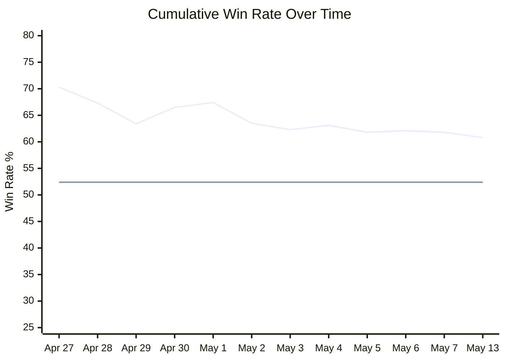
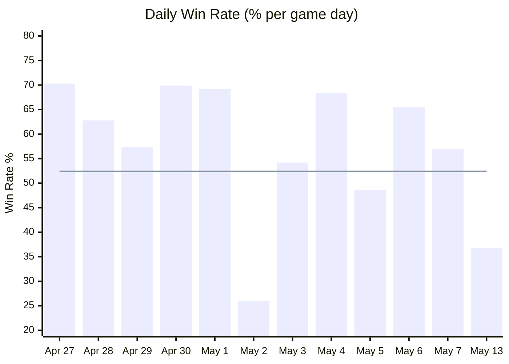
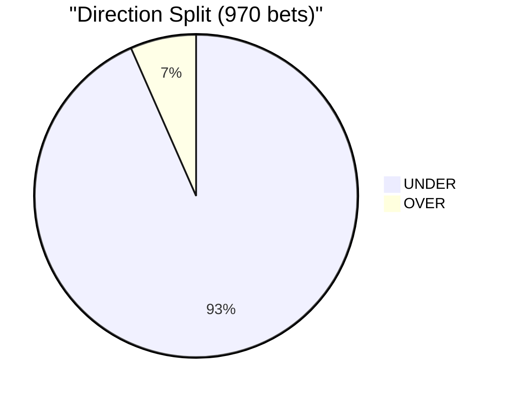
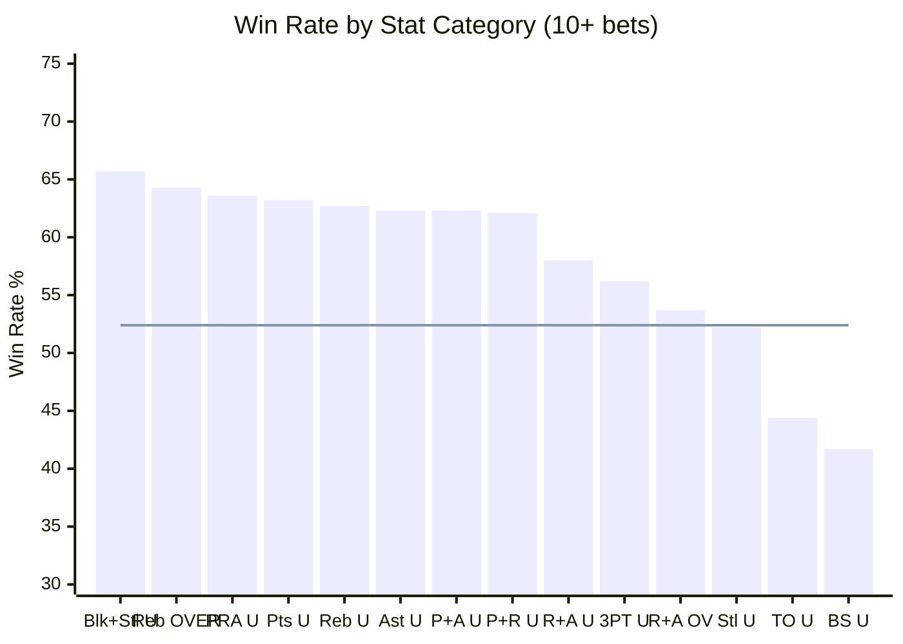

# Sharp Edge V2.1 — Performance Report

> **Period:** April 27 – May 13, 2026 (12 game days)
> **Total Graded:** 970 unique bets | **590W / 380L** | **60.8% Win Rate** 🟢
> **Breakeven:** 52.4% | **Edge Over Breakeven:** +8.4 percentage points

---

## 1. Win Rate Over Time

The engine started extremely hot and has gradually regressed toward a stable ~61% floor.

> [!NOTE]
> The dashed lower line is the 52.4% breakeven. V2.1 has never dropped below it on a cumulative basis. The convergence from 70% → 61% is expected — early small-sample variance smoothing out.

## 2. Daily Performance

| Date | Bets | W | L | Win Rate | Notes |
|------|------|---|---|----------|-------|
| Apr 27 | 64 | 45 | 19 | **70.3%** 🟢 | Launch day — hot start |
| Apr 28 | 43 | 27 | 16 | **62.8%** 🟢 | Solid |
| Apr 29 | 68 | 39 | 29 | **57.4%** 🟡 | Banchero 45-pt explosion |
| Apr 30 | 156 | 109 | 47 | **69.9%** 🟢 | Best high-volume day |
| May 1 | 156 | 108 | 48 | **69.2%** 🟢 | Consistent |
| **May 2** | **50** | **13** | **37** | **26.0%** 🔴 | Catastrophic day |
| May 3 | 83 | 45 | 38 | **54.2%** 🟡 | Barely profitable |
| May 4 | 98 | 67 | 31 | **68.4%** 🟢 | Strong bounce-back |
| May 5 | 72 | 35 | 37 | **48.6%** 🔴 | Below breakeven |
| May 6 | 84 | 55 | 29 | **65.5%** 🟢 | Recovered |
| May 7 | 58 | 33 | 25 | **56.9%** 🟡 | Thin edge |
| **May 13** | **38** | **14** | **24** | **36.8%** 🔴 | Bad day |

> [!WARNING]
> **May 2 (26.0%) and May 13 (36.8%)** are concerning outliers. These need investigation — were there widespread lineup changes, injuries, or game script anomalies on these dates?

---

## 3. OVER vs UNDER

| Direction | Record | Win Rate |
|-----------|--------|---------|
| **UNDER** | 555/906 | **61.3%** 🟢 |
| **OVER** | 35/64 | **54.7%** 🟡 |

The engine is overwhelmingly an UNDER machine — 93% of volume. UNDER bets outperform OVER bets by 6.6 points. This makes sense given the strategy filter blocks all scoring OVER bets.

---

## 4. By Stat Type + Direction

| Stat + Direction | W | L | Total | Win Rate | Status |
|-----------------|---|---|-------|---------|--------|
| Blks+Stls UNDER | 23 | 12 | 35 | **65.7%** | 🟢 Profitable |
| Rebounds OVER | 9 | 5 | 14 | **64.3%** | 🟢 Profitable |
| Pts+Rebs+Asts UNDER | 89 | 51 | 140 | **63.6%** | 🟢 Profitable |
| Points UNDER | 86 | 50 | 136 | **63.2%** | 🟢 Profitable |
| Rebounds UNDER | 52 | 31 | 83 | **62.7%** | 🟢 Profitable |
| Assists UNDER | 43 | 26 | 69 | **62.3%** | 🟢 Profitable |
| Pts+Asts UNDER | 81 | 49 | 130 | **62.3%** | 🟢 Profitable |
| Pts+Rebs UNDER | 82 | 50 | 132 | **62.1%** | 🟢 Profitable |
| Rebs+Asts UNDER | 65 | 47 | 112 | **58.0%** | 🟡 Marginal |
| 3-PT Made UNDER | 9 | 7 | 16 | **56.2%** | 🟡 Marginal |
| Rebs+Asts OVER | 22 | 19 | 41 | **53.7%** | 🟡 Thin edge |
| Steals UNDER | 12 | 11 | 23 | **52.2%** | ⚠️ Near breakeven |
| **Turnovers UNDER** | **8** | **10** | **18** | **44.4%** | 🔴 Money loser |
| **Blocked Shots UNDER** | **5** | **7** | **12** | **41.7%** | 🔴 Money loser |

> [!IMPORTANT]
> **Turnovers UNDER (44.4%) and Blocked Shots UNDER (41.7%)** should be added to the BLOCKED list. They're losing money over 30 combined bets — enough data to act on.

---

## 5. Tier Performance

| Tier | Record | Win Rate | Expected |
|------|--------|---------|----------|
| 🟡 CAUTIOUS | 107/160 | **66.9%** | Best-performing tier |
| 🟡 STANDARD | 303/485 | **62.5%** | Workhorse |
| 🟢 ELITE | 46/75 | **61.3%** | Below CAUTIOUS |
| 🟡 DEFAULT | 60/110 | **54.5%** | Barely profitable |
| 🟢 STRONG | 74/140 | **52.9%** | Near breakeven |

> [!WARNING]
> **The tier inversion persists at scale.** 🟡 CAUTIOUS (66.9%) is beating 🟢 ELITE (61.3%) and 🟢 STRONG (52.9%) over 970 bets. The 🟢 STRONG tier at 52.9% is barely above breakeven — this needs another recalibration.

---

## 6. Edge Size Analysis

| Edge Bucket | Record | Win Rate |
|-------------|--------|---------|
| 10-15% (capped) | 418/667 | **62.7%** 🟢 |
| 2.5-5% | 26/44 | **59.1%** |
| 8-10% | 56/99 | **56.6%** |
| 5-8% | 90/160 | **56.2%** |

> [!NOTE]
> The 15%-capped edges (10-15% bucket) actually perform the best. This is the inverse of what V2.0 showed — the edge cap at 15% fixed the "mirage" problem from V2.0 where 20%+ edges were performing at 41%.

---

## 7. Confidence Score vs Win Rate

| Confidence | Record | Win Rate |
|-----------|--------|---------|
| 75+ | 38/58 | **65.5%** |
| 65-70 | 159/257 | **61.9%** |
| 70-75 | 81/133 | **60.9%** |
| 55-60 | 106/176 | **60.2%** |
| 60-65 | 205/342 | **59.9%** |

Confidence is **weakly predictive** — 75+ does lead but the spread is narrow (65.5% vs 59.9%). Not reliable enough to use as a sole filter.

---

## 8. Player Leaderboard

### 🏆 Top Performers (5+ bets)

| Player | Bets | W | L | Win Rate |
|--------|------|---|---|---------|
| Stephon Castle | 7 | 7 | 0 | **100%** |
| Nikola Jokić | 10 | 10 | 0 | **100%** |
| CJ McCollum | 10 | 10 | 0 | **100%** |
| Collin Murray-Boyles | 12 | 12 | 0 | **100%** |
| SGA | 17 | 16 | 1 | **94.1%** |
| Anthony Edwards | 15 | 14 | 1 | **93.3%** |
| Jamal Murray | 13 | 12 | 1 | **92.3%** |
| Josh Hart | 23 | 20 | 3 | **87.0%** |
| Reed Sheppard | 13 | 11 | 2 | **84.6%** |

### 💀 Worst Performers (5+ bets)

| Player | Bets | W | L | Win Rate |
|--------|------|---|---|---------|
| Chet Holmgren | 6 | 0 | 6 | **0.0%** |
| Ajay Mitchell | 19 | 3 | 16 | **15.8%** |
| Duncan Robinson | 10 | 2 | 8 | **20.0%** |
| Jarrett Allen | 9 | 2 | 7 | **22.2%** |
| Scottie Barnes | 17 | 4 | 13 | **23.5%** |
| Mike Conley | 22 | 8 | 14 | **36.4%** |
| Paolo Banchero | 24 | 9 | 15 | **37.5%** |

> [!IMPORTANT]
> **Consider a player blacklist:** Ajay Mitchell (15.8%), Duncan Robinson (20%), Jarrett Allen (22.2%), and Scottie Barnes (23.5%) are consistently wrong. The model is systematically mis-projecting these players.

---

## 9. Projection Accuracy

| Stat Type | Mean Absolute Error | Bets |
|-----------|-------------------|------|
| Steals | 0.72 | 23 |
| 3-PT Made | 0.91 | 17 |
| Blks+Stls | 0.95 | 38 |
| Blocked Shots | 1.20 | 12 |
| Turnovers | 1.39 | 20 |
| Assists | 1.63 | 72 |
| Rebounds | 2.21 | 97 |
| Rebs+Asts | 3.08 | 153 |
| Points | 4.76 | 136 |
| Pts+Asts | 5.46 | 130 |
| Pts+Rebs | 5.75 | 132 |
| Pts+Rebs+Asts | 6.14 | 140 |

Overall MAE: **4.01** | Median AE: **2.71**

The projections are most accurate on low-count stats (steals, blocks) and least accurate on combo stats — expected since combo errors compound from component errors.

---

## 10. Recommended Actions

### Immediate Changes
1. **🔴 Block Turnovers UNDER** (44.4%) and **Blocked Shots UNDER** (41.7%) — proven money losers
2. **Demote 🟢 STRONG tier** — 52.9% is barely profitable, raise its edge threshold to 8%+ or demote to CAUTIOUS
3. **Consider a player blacklist** for Ajay Mitchell, Duncan Robinson, Jarrett Allen, Scottie Barnes — model is systematically wrong on these

### Investigate
4. **May 2 and May 13 catastrophes** — what happened on those days? Widespread upsets, lineup changes?
5. **Rebs+Asts UNDER at 58%** — was the top performer early but has regressed. Watch for another 2 weeks

### Hold
6. **Confidence scoring** — weakly predictive, not worth acting on yet
7. **Edge size** — the 15% cap is working correctly, don't change

---

## V2.1 vs V2.0 Comparison

| Metric | V2.0 (1,830 bets) | V2.1 (970 bets) | Change |
|--------|-------------------|-----------------|--------|
| **Win Rate** | 44.6% | **60.8%** | **+16.2 pts** 🟢 |
| Scoring OVER WR | 38-42% | Blocked | Fixed ✅ |
| Edge 20%+ WR | 41.3% | Capped at 15% | Fixed ✅ |
| Vetoed plays WR | 38.9% | Not logged | Fixed ✅ |
| Daily consistency | Volatile | 8/12 days profitable | Improved ✅ |
